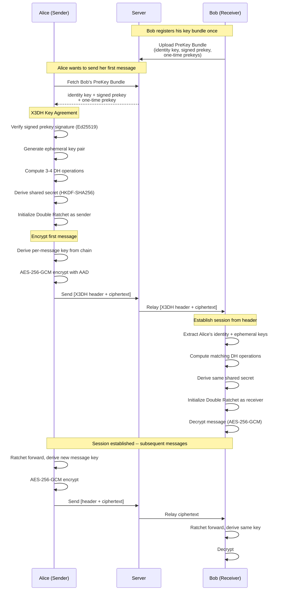
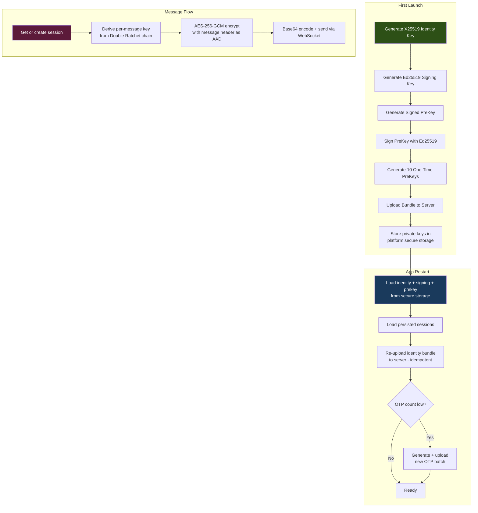
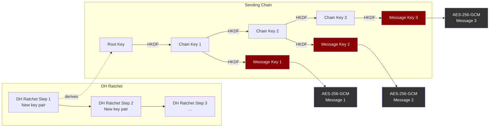

# Echo - Encrypted Messenger

A lightweight, cross-platform messaging app with end-to-end encryption. I'm not a fan of the direction discord is moving, and I don't think most people can setup Matrix, so this is my attempt at a replacement. I will be setting it up by default centralized, but there is always an option to host the server yourself.

## Downloads

Get the latest buildw from the [Releases page](https://github.com/NC1107/echo-messenger/releases).

| Platform | Download |
|----------|----------|
| Windows | [Echo-Setup-x64.exe](https://github.com/NC1107/echo-messenger/releases/latest/download/Echo-Setup-x64.exe) (installer) |
| Linux | [Echo-x86_64.AppImage](https://github.com/NC1107/echo-messenger/releases/latest/download/Echo-x86_64.AppImage) (single file) |
| Web | [echo-messenger.us](https://echo-messenger.us) or [echo-web.tar.gz](https://github.com/NC1107/echo-messenger/releases/latest/download/echo-web.tar.gz) (static files) |
| Server | [echo-server-linux-x64.tar.gz](https://github.com/NC1107/echo-messenger/releases/latest/download/echo-server-linux-x64.tar.gz) |
| Docker | `ghcr.io/nc1107/echo-messenger/server:latest` |

## Features

- **End-to-end encryption** -- Signal Protocol (X3DH + Double Ratchet).
- **1:1 and group messaging** -- Real-time via WebSocket
- **Group management** -- Public/private groups, owner/admin roles, kick members, edit group name, invite links
- **Public group discovery** -- Browse and join public groups with membership badges
- **Media sharing** -- Upload images, videos, PDFs. Inline image previews with lightbox viewer.
- **Message editing and deletion** -- Edit/delete your messages, changes propagate in real-time
- **Message reactions** -- Tap to react with emoji
- **Privacy controls** -- Toggle read receipts
- **Username DM invites** -- Share `#/u/{username}` deep links and QR codes to add contacts quickly
- **Per-message encryption indicator** -- Lock icon shows which messages were encrypted
- **Typing indicators** -- See when someone is typing
- **Conversations list** -- Last message preview, unread badges, timestamps
- **Cross-platform** -- Windows, Linux, Web, iOS, Android
- **Lightweight** -- <150MB RAM idle (vs Discord's 500MB+)

## Status

| Component | Status |
|-----------|--------|
| User auth (Argon2id + JWT) | Working |
| 1:1 messaging | Working |
| Group messaging | Working |
| E2E encryption (Signal Protocol) | Working (optional per-conversation) |
| Encryption toggle + WS sync | Working |
| Contacts system | Working |
| Media upload/download | Working |
| Message edit/delete | Working |
| Group owner management | Working |
| Public group discovery | Working |
| Privacy settings | Working |
| Typing indicators | Working |
| Message reactions | Working |
| CI/CD pipelines | Working |
| Multi-OS releases | Automated |

## Architecture

```
Flutter Client (Linux, Windows, Web)
  ├── Riverpod state management
  ├── GoRouter navigation
  ├── WebSocket real-time messaging
  └── Signal Protocol encryption (X3DH + Double Ratchet)

Rust Server (Axum + PostgreSQL)
  ├── REST API (auth, contacts, groups, messages, media, privacy)
  ├── WebSocket hub (message relay, typing, reactions, encryption sync)
  ├── JWT auth (15-min access + 7-day refresh tokens)
  ├── Argon2id password hashing
  └── 15 auto-applied SQL migrations

Deployment
  ├── Docker + Traefik reverse proxy
  ├── Watchtower auto-updates
  ├── Cloudflare CDN
  └── GitHub Actions CI/CD (lint, test, build, release)
```

## Encryption Protocol

Echo uses the **Signal Protocol** (X3DH + Double Ratchet) for end-to-end encrypted direct messages. The server never sees plaintext -- it stores and relays only ciphertext.

### How It Works

When two users message for the first time, a secure session is established using **X3DH** (Extended Triple Diffie-Hellman). Every subsequent message uses the **Double Ratchet** to derive a unique per-message key, providing forward secrecy and break-in recovery.



### Key Management



### Double Ratchet

Each message uses a **unique encryption key** derived from an evolving chain. Even if one key is compromised, past and future messages remain secure.



### Wire Format

| Message Type | Format |
|---|---|
| Initial (V2, with OTP) | `[0xEC 0x02]` + identity_pub(32) + ephemeral_pub(32) + otp_id(4 LE) + ratchet_wire |
| Initial (V1, no OTP) | `[0xEC 0x01]` + identity_pub(32) + ephemeral_pub(32) + ratchet_wire |
| Normal | header_len(4 LE) + header(40) + nonce(12) + ciphertext + tag(16) |

All messages are base64-encoded over WebSocket. The server relays them without inspection.

### Security Properties

| Property | Mechanism |
|---|---|
| **Confidentiality** | AES-256-GCM per-message encryption |
| **Forward Secrecy** | Double Ratchet -- new key per message |
| **Break-in Recovery** | DH ratchet step on every reply |
| **Authentication** | Ed25519 signed prekey prevents MITM |
| **Integrity** | GCM authentication tag on every message |
| **Replay Protection** | Per-message counters + consumed keys |
| **Zero-Knowledge Server** | Server stores only ciphertext |

### Storage

| Data | Where | Notes |
|---|---|---|
| Identity keys | Platform secure storage (Keychain / Keystore / libsecret / DPAPI) | Survives app restarts |
| Session state | Platform secure storage | Full Double Ratchet state per peer |
| Decrypted messages | Hive local DB | Plaintext cache for instant display |
| Encrypted messages | Server PostgreSQL | Ciphertext only -- server cannot decrypt |

See [docs/SECURITY.md](docs/SECURITY.md) for reporting vulnerabilities.

## Quick Start

```bash
# Clone
git clone https://github.com/NC1107/echo-messenger.git
cd echo-messenger

# Start everything (DB + server + test user)
./scripts/run.sh

# Or manually:
cd infra/docker && docker compose up -d    # Start PostgreSQL
cargo run -p echo-server                    # Start server on :8080
cd apps/client && flutter run -d linux      # Start client
```

## Development

See [docs/setup.md](docs/setup.md) for full setup instructions.

### Prerequisites
- Rust (edition 2024)
- Flutter 3.41+
- Docker (for PostgreSQL)
- Node.js 20+ (for commitlint)

### Running Tests
```bash
cargo test --workspace                        # 241 Rust tests
cd apps/client && flutter test                # 55 Flutter tests
./scripts/test_e2e.sh                         # E2E integration tests
npx playwright test                           # Visual tests
```

### Lint & Format
```bash
cargo fmt --all -- --check
cargo clippy --workspace --all-targets
cd apps/client && dart format --set-exit-if-changed .
cd apps/client && flutter analyze --fatal-infos
```

## License

[PolyForm Noncommercial 1.0.0](https://polyformproject.org/licenses/noncommercial/1.0.0). See [LICENSE](LICENSE).

This is a **source-available** license — anyone may use, modify, and contribute to Echo for any **non-commercial** purpose (personal, hobby, educational, non-profit, public-research, religious). Selling it, hosting it as a paid service, or using it inside a commercial entity is **not permitted** without a separate commercial license from the copyright holder.

Contributions are welcome via pull request. By submitting a contribution you agree that your changes are released under the same license.
