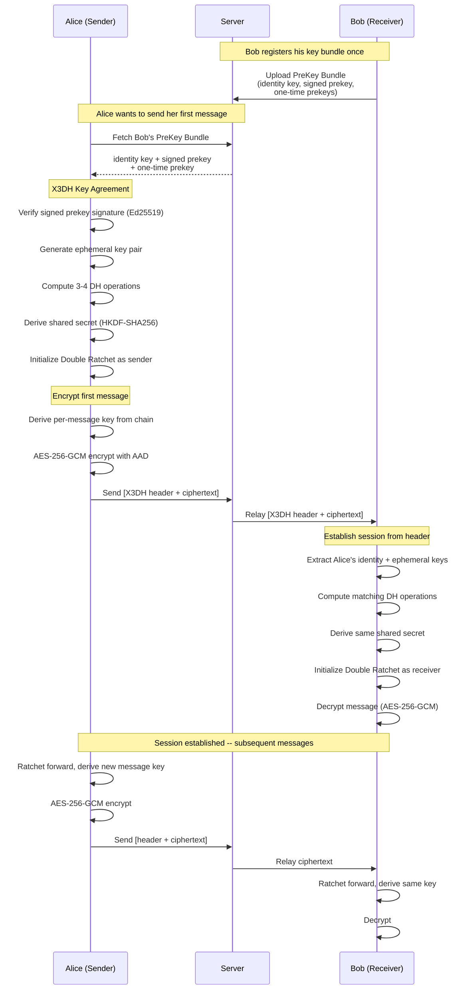
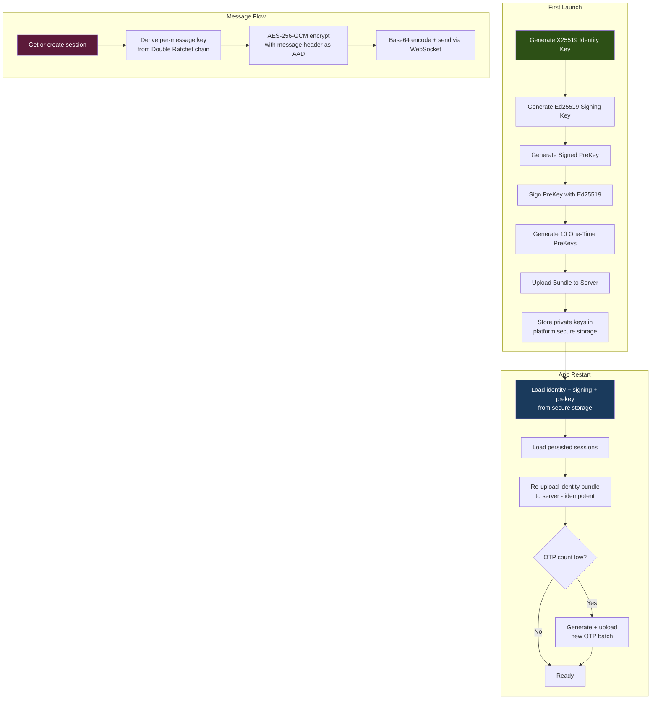
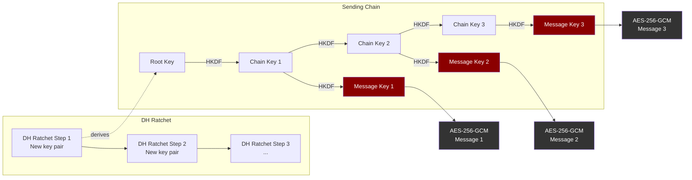

# Encryption Protocol

Echo uses the **Signal Protocol** (X3DH + Double Ratchet) for end-to-end encrypted direct messages. The server never sees plaintext -- it stores and relays only ciphertext.

## How It Works

When two users message for the first time, a secure session is established using **X3DH** (Extended Triple Diffie-Hellman). Every subsequent message uses the **Double Ratchet** to derive a unique per-message key, providing forward secrecy and break-in recovery.

## Key Management

## Double Ratchet

Each message uses a **unique encryption key** derived from an evolving chain. Even if one key is compromised, past and future messages remain secure.

## Wire Format

| Message Type | Format |
|---|---|
| Initial (V2, with OTP) | `[0xEC 0x02]` + identity_pub(32) + ephemeral_pub(32) + otp_id(4 LE) + ratchet_wire |
| Initial (V1, no OTP) | `[0xEC 0x01]` + identity_pub(32) + ephemeral_pub(32) + ratchet_wire |
| Normal | header_len(4 LE) + header(40) + nonce(12) + ciphertext + tag(16) |

All messages are base64-encoded over WebSocket. The server relays them without inspection.

## Security Properties

| Property | Mechanism |
|---|---|
| **Confidentiality** | AES-256-GCM per-message encryption |
| **Forward Secrecy** | Double Ratchet -- new key per message |
| **Break-in Recovery** | DH ratchet step on every reply |
| **Authentication** | Ed25519 signed prekey prevents MITM |
| **Integrity** | GCM authentication tag on every message |
| **Replay Protection** | Per-message counters + consumed keys |
| **Zero-Knowledge Server** | Server stores only ciphertext |

## Key Storage

| Data | Where | Notes |
|---|---|---|
| Identity keys | Platform secure storage (Keychain / Keystore / libsecret / DPAPI) | Survives app restarts |
| Session state | Platform secure storage | Full Double Ratchet state per peer |
| Decrypted messages | Hive local DB | Plaintext cache for instant display |
| Encrypted messages | Server PostgreSQL | Ciphertext only -- server cannot decrypt |
